# Возможности системы:</h2>
1. Добавлять клиентов в базу даных.</p>
2. Добавлять посты в базу даных.</p>
3. Делать рассылку сообщений в телеграмме.</p>
4. Делать выгрузку клиентов и постов в формате json.</p>

# Начало работы:
1. Получить API_ID, API_HASH
Переходим по https://my.telegram.org/apps

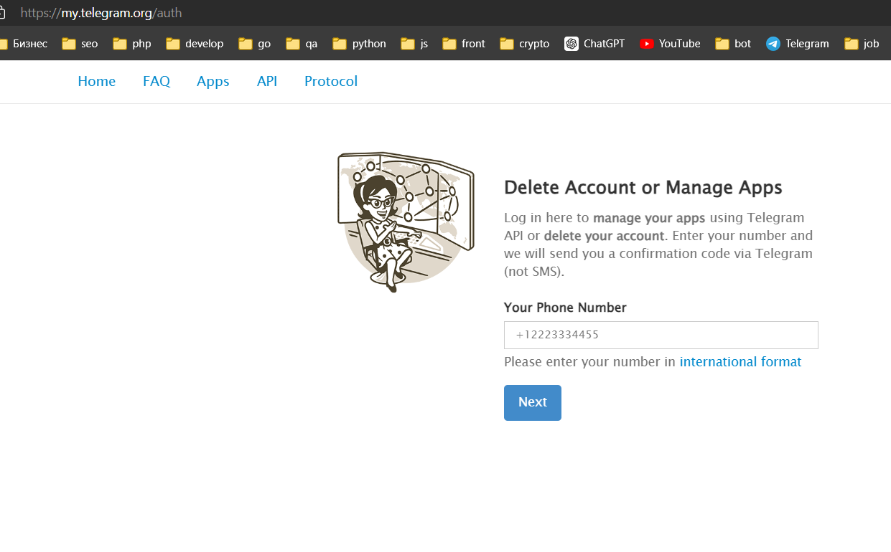
Проходим регистрацию

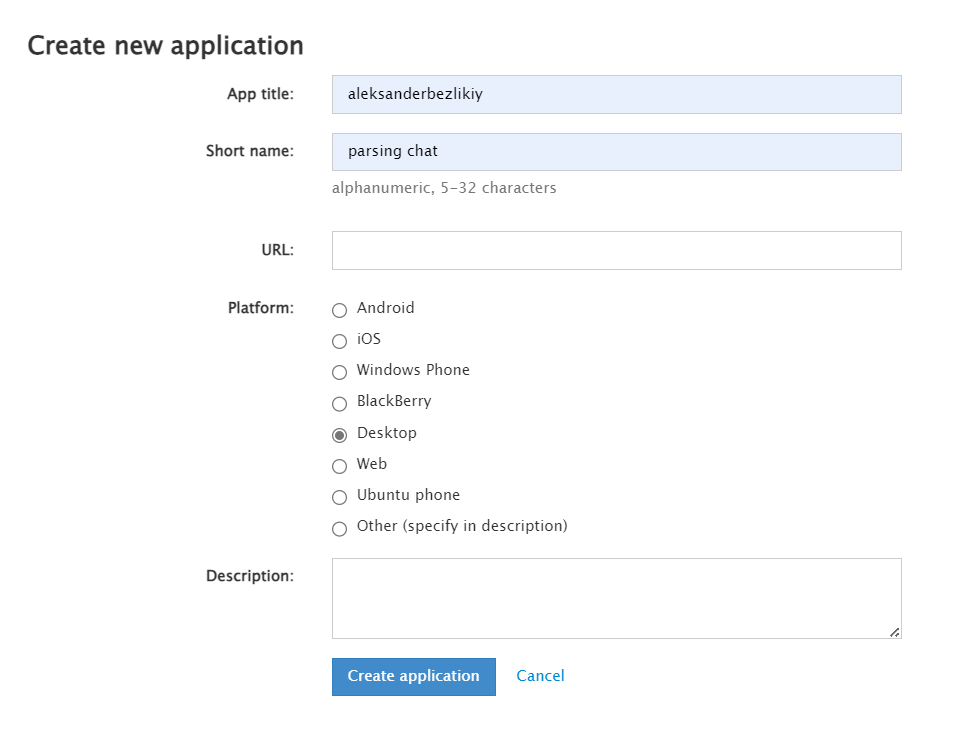
Копируем API_ID, API_HASH

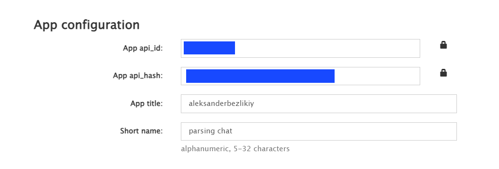
2. Настраиваем .env
````
API_ID=
API_HASH=
PHONE=
URL_PATH=http://127.0.0.1:8080
USER_ID= //ID телеграмма пользователя системы
//Выбор БД(тестирование и рабочая)
DATABASE_URL=db.sqlite
DATABASE_URL=test.sqlite
USER_EMAIL=admin@admin.ua //логин для входа
USER_PASSWORD=password //пароль для входа
DEEP_LIMIT=100 //количество записей для сканирования
````
3. Настраиваем front
Переходим в front/src/components/helps/getUrls.mjs
```
export const url_path = "http://127.0.0.1:8080"
export const curr_url = "http://127.0.0.1:3000"
```
4. Запускаем проект
````
pip install -r requirements.txt
python index.py

cd front
npm install
npm run start
````

5. Авторизация


Данные берем из .env

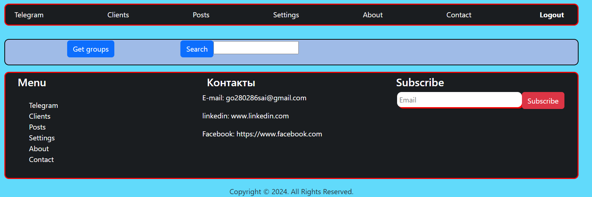
6. Поиск групп

Get groups - показывает список открытых групп владельца

Search - выполняет глобальный поиск слова по всем группам по заданной глубине в .env

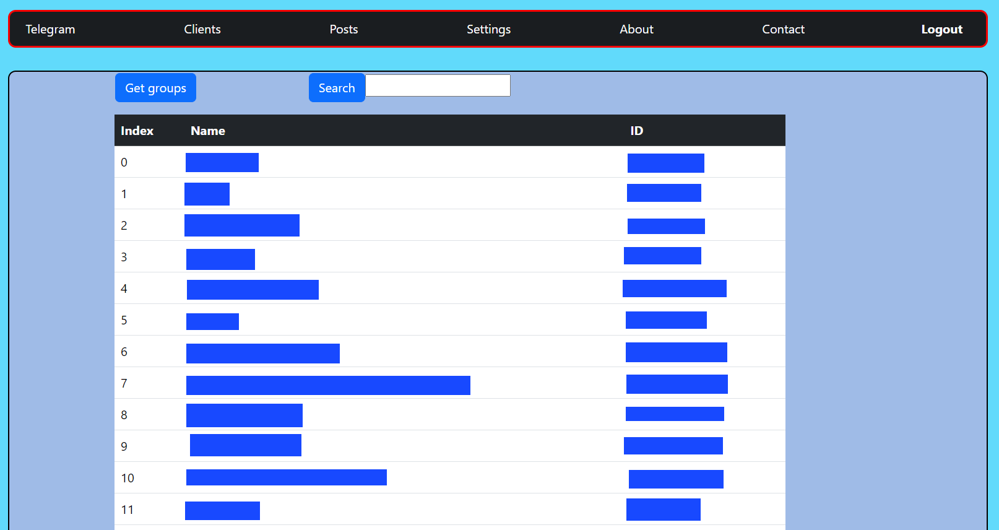

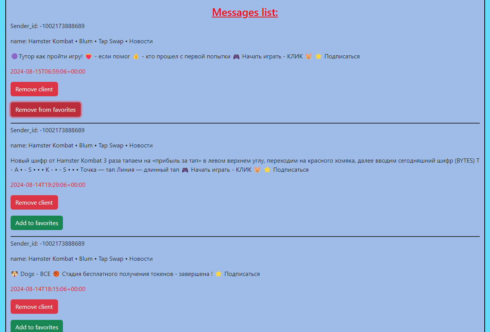
Можно добавлять в список клиентов и в список сообщений, также удалять.

7. Вкладка Clients
Отображает список всех доступных в базе клиентов с возможность массовой рассылки им.

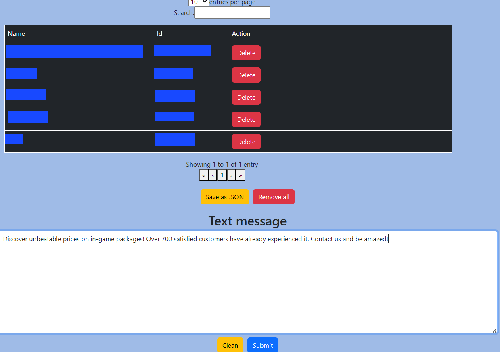

8. Save as JSON
Сохраняет список на компьютер в формате JSON

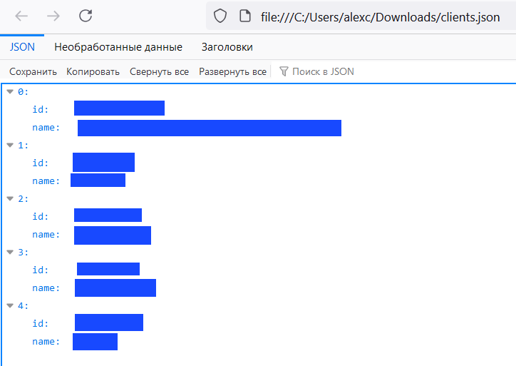

9. Вкладка Posts

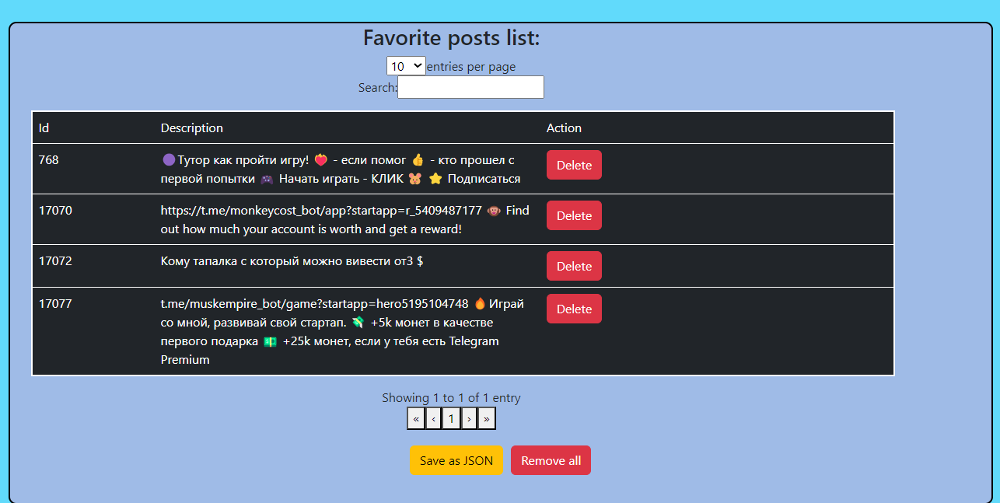

10. Save as JSON

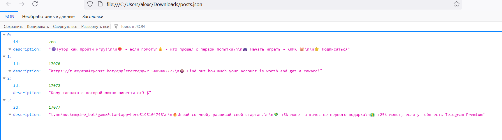

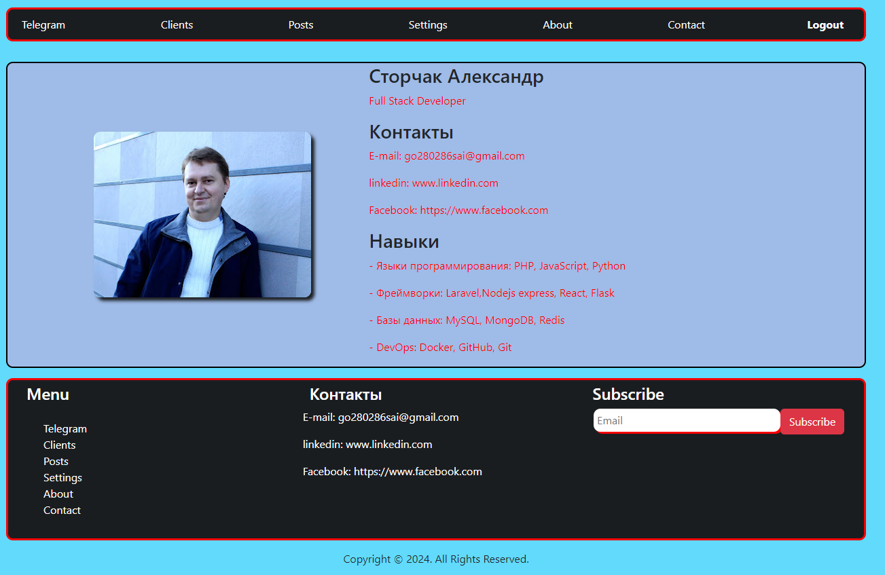
